<div align="center">

# 💼 Wazivo - Get Hired, Get Wazivo

**AI-powered resume analyzer that helps you land your dream job**

[](https://github.com/SamoTech/Wazivo/stargazers)
[](https://github.com/SamoTech/Wazivo/network/members)
[](https://github.com/SamoTech/Wazivo/issues)
[](https://github.com/SamoTech/Wazivo/blob/main/LICENSE)

[](https://nextjs.org/)
[](https://www.typescriptlang.org/)
[](https://tailwindcss.com/)
[](https://groq.com/)

[](https://vercel.com)
[](https://github.com/SamoTech/Wazivo)
[](https://github.com/SamoTech/Wazivo/commits/main)


[](https://github.com/SamoTech/Wazivo)

[**🚀 Live Demo**](https://wazivo.vercel.app) | [**📚 Documentation**](https://github.com/SamoTech/Wazivo/wiki) | [**🐛 Report Bug**](https://github.com/SamoTech/Wazivo/issues) | [**💡 Request Feature**](https://github.com/SamoTech/Wazivo/issues)

</div>

---

## 🎯 What is Wazivo?

**Wazivo** (وظيفو) is your intelligent career companion. Upload your CV, get AI-powered insights, discover matching jobs, identify skill gaps, and receive personalized course recommendations.

> 🌟 Built with Next.js 14, TypeScript, and Groq's lightning-fast AI inference for maximum performance.

## ✨ Key Features

<table>
<tr>
<td>

### 📄 Smart CV Parsing
- PDF, DOCX, DOC support
- Image OCR with Tesseract
- URL fetching
- Multi-language support

</td>
<td>

### 🤖 AI-Powered Analysis
- Groq + LLaMA 3.3 70B
- Lightning-fast inference
- Skill extraction
- Gap identification

</td>
</tr>
<tr>
<td>

### 💼 Real-Time Job Search
- 10+ job platforms
- Smart matching algorithm
- Location-based results
- Remote job filtering

</td>
<td>

### 📚 Course Recommendations
- Personalized learning paths
- Udemy, Coursera, edX
- Skill-gap aligned
- Free & paid options

</td>
</tr>
</table>

## 🚀 Quick Start

```bash
# Clone the repository
git clone https://github.com/SamoTech/Wazivo.git

# Navigate to project directory
cd Wazivo

# Install dependencies
npm install

# Create environment file
cp .env.example .env

# Add your Groq API key to .env
# GROQ_API_KEY=gsk-your-key-here
# Get free API key: https://console.groq.com

# Run development server
npm run dev
```

Open [http://localhost:3000](http://localhost:3000) 🎉

## 🔑 Environment Variables

| Variable | Required | Description | Get It From |
|----------|----------|-------------|-------------|
| `GROQ_API_KEY` | ✅ Yes | Groq API key for lightning-fast AI inference | [Groq Console](https://console.groq.com) |
| `GROQ_MODEL` | ❌ Optional | Model to use (default: llama-3.3-70b-versatile) | - |
| `ADZUNA_APP_ID` | ❌ Optional | Adzuna job search API | [Adzuna Developer](https://developer.adzuna.com) |
| `ADZUNA_APP_KEY` | ❌ Optional | Adzuna API key | [Adzuna Developer](https://developer.adzuna.com) |
| `RAPIDAPI_KEY` | ❌ Optional | RapidAPI key for JSearch | [RapidAPI](https://rapidapi.com) |

### Available Groq Models:
- `llama-3.3-70b-versatile` (Default - Best quality)
- `mixtral-8x7b-32768` (Fast with long context)
- `gemma2-9b-it` (Lightweight & fast)

## 📦 Tech Stack

<div align="center">

| Category | Technology |
|----------|------------|
| **Framework** | Next.js 14 (App Router) |
| **Language** | TypeScript 5.3 |
| **Styling** | Tailwind CSS 3.4 |
| **AI/ML** | Groq (LLaMA 3.3 70B) |
| **Parsing** | pdf-parse, mammoth, tesseract.js |
| **Job Search** | Adzuna, JSearch, Custom scraping |
| **Icons** | Lucide React |
| **Deployment** | Vercel |

</div>

## 🏗️ Project Structure

```
wazivo/
├── 📂 src/
│   └── 📂 app/
│       ├── 📂 api/
│       │   └── 📂 analyze/
│       │       └── 📝 route.ts          # API endpoint
│       ├── 📂 components/
│       │   ├── 📝 FileUpload.tsx     # CV upload component
│       │   ├── 📝 LoadingState.tsx   # Loading UI
│       │   └── 📝 AnalysisResults.tsx # Results display
│       ├── 📂 lib/
│       │   ├── 📝 cvParser.ts        # CV parsing logic
│       │   ├── 📝 openaiService.ts   # AI analysis (Groq)
│       │   ├── 📝 jobSearchService.ts # Job search
│       │   └── 📝 utils.ts           # Utilities
│       ├── 📂 types/
│       │   └── 📝 index.ts           # TypeScript types
│       ├── 🎨 globals.css          # Global styles
│       ├── 📝 layout.tsx           # Root layout
│       └── 📝 page.tsx             # Main page
├── 📦 package.json
├── ⚙️ next.config.js
├── ⚙️ tailwind.config.ts
└── ⚙️ tsconfig.json
```

## 🚢 Deployment

### Deploy to Vercel (Recommended)

[](https://vercel.com/new/clone?repository-url=https://github.com/SamoTech/Wazivo)

1. Click the button above
2. Import your GitHub repository
3. Add environment variables:
   - `GROQ_API_KEY` (get from [console.groq.com](https://console.groq.com))
4. Deploy! 🎉

Your app will be live at: `https://wazivo.vercel.app`

### Other Platforms

<div align="center">

| Platform | Status | Guide |
|----------|--------|-------|
| **Vercel** | ✅ Tested | [Deploy Guide](https://vercel.com/docs) |
| **Netlify** | ✅ Compatible | [Deploy Guide](https://docs.netlify.com) |
| **Railway** | ✅ Compatible | [Deploy Guide](https://docs.railway.app) |
| **AWS Amplify** | ✅ Compatible | [Deploy Guide](https://docs.amplify.aws) |

</div>

## 💰 Cost Estimate

| Service | Cost | Notes |
|---------|------|-------|
| **Groq API** | **FREE** | Free tier: 14,400 requests/day |
| **Job APIs** | Free | Adzuna & JSearch free tiers |
| **Hosting** | Free | Vercel/Netlify free tier |
| **Monthly Total** | **$0** | 🎉 Completely free! |

> ⚡ **Why Groq?** Lightning-fast inference (10-100x faster than OpenAI), generous free tier, and same quality results!

## 🎨 Branding

<div align="center">

| Element | Value |
|---------|-------|
| **Name** | Wazivo (وظيفو) |
| **Meaning** | From "وظيفة" (Job) + modern tech ending |
| **Tagline** | "Get Hired, Get Wazivo" |
| **Primary Color** | Blue (#0066FF) |
| **Secondary Color** | Orange (#FF6B35) |
| **Icon** | 💼 Briefcase |

</div>

> 📚 See [BRANDING.md](https://github.com/SamoTech/Wazivo/blob/main/BRANDING.md) for complete brand guidelines

## 📖 How It Works

```mermaid
graph LR
    A[📄 Upload CV] --> B[🔍 Parse Content]
    B --> C[🤖 Groq AI Analysis]
    C --> D[💼 Job Search]
    C --> E[🎯 Identify Gaps]
    E --> F[📚 Course Recommendations]
    D --> G[📊 Generate Report]
    F --> G
    G --> H[✅ Take Action]
```



## 🤝 Contributing

We love contributions! 💙

1. Fork the repository
2. Create your feature branch (`git checkout -b feature/amazing-feature`)
3. Commit your changes (`git commit -m '✨ Add amazing feature'`)
4. Push to the branch (`git push origin feature/amazing-feature`)
5. Open a Pull Request

See [CONTRIBUTING.md](https://github.com/SamoTech/Wazivo/blob/main/CONTRIBUTING.md) for detailed guidelines.

## 📝 License

This project is licensed under the MIT License - see the [LICENSE](https://github.com/SamoTech/Wazivo/blob/main/LICENSE) file for details.

## 🌟 Support the Project

If you find Wazivo helpful:

- ⭐ Star the repo
- 🐛 [Report bugs](https://github.com/SamoTech/Wazivo/issues)
- 💡 [Suggest features](https://github.com/SamoTech/Wazivo/issues)
- 📢 Share with friends
- 💖 [Sponsor on GitHub](https://github.com/sponsors/SamoTech)

## 🔗 Connect & Support

<div align="center">

### 🌐 Find Us Online

[](https://github.com/SamoTech)
[](https://twitter.com/OssamaHashim)
[](https://www.linkedin.com/in/ossamahashim/)
[](https://www.facebook.com/ossama.hashim)

### 💼 Project Links

[](https://wazivo.vercel.app)
[](https://github.com/SamoTech/Wazivo/wiki)
[](https://github.com/sponsors/SamoTech)

### 👍 Follow & Support

[](https://github.com/SamoTech)
[](https://twitter.com/OssamaHashim)
[](https://github.com/sponsors/SamoTech)

</div>

## 👥 About the Developer

<div align="center">

**Built with ❤️ by [Ossama Hashim](https://github.com/SamoTech)**

*Full-stack developer passionate about AI, automation, and career tech*

</div>

---

<div align="center">

### Get Hired, Get Wazivo 💼

**[Start Analyzing Your CV Now →](https://wazivo.vercel.app)**

*Powered by Groq's lightning-fast AI ⚡ | Sponsorship Policy: GitHub Sponsors only 💖*

</div>